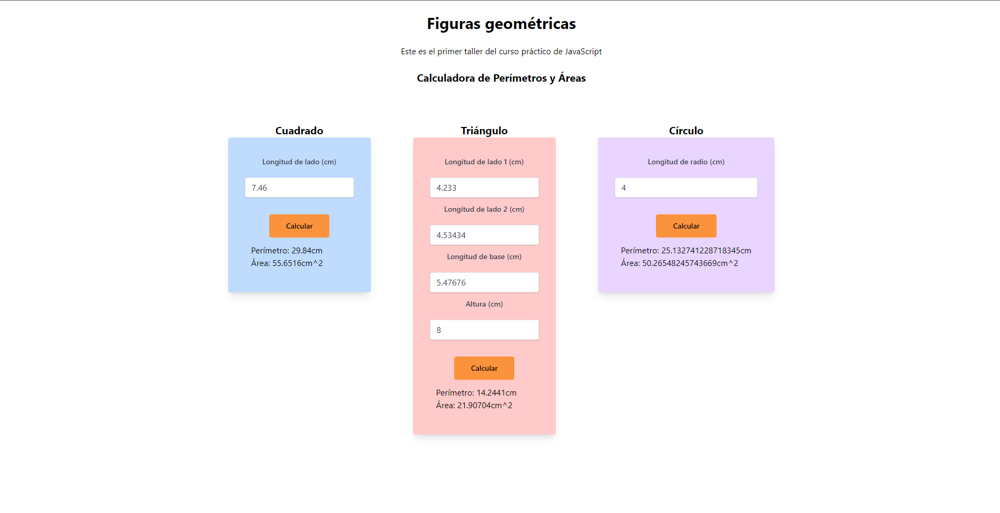

# curso-practico-javascript
Curso práctico de Javascript impartido por Platzi. 

## Taller #1: Figuras Geométricas ##

- Primer paso: Definir las fórmulas
- Segundo paso: Implementar las fórmulas en JavaScript. 
- Tercer paso: crear funciones 
- Cuarto paso: integrar JavaScript con HTML. 

### Taller 1 Preview ###

## Taller #2: Porcentajes y descuentos ##

- Primer paso: Definir las fórmulas
- Segundo paso: Implementar las fórmulas en JavaScript. 
- Tercer paso: crear funciones 
- Cuarto paso: integrar JS con HTML. 

## Taller #3: promedio, mediana y moda ##

- Primer paso: Definir las fórmulas
- Segundo paso: Implementar las fórmulas en JavaScript. 
- Tercer paso: crear funciones